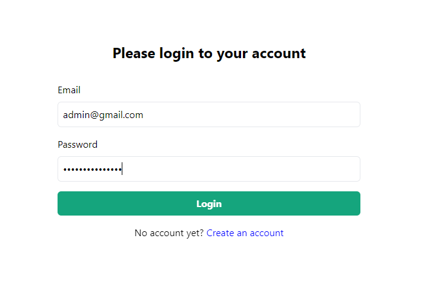
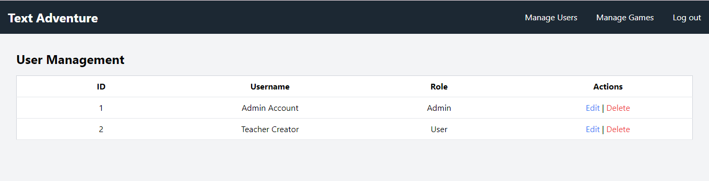

# ta4e
## Text Adventure Game for Education
### CS461-463 Project OSU
## Contributors
#### Vitaliy Samonov
#### Harinder Garchah
#### Hrishikash Kadakia 
#### Nathan Cahoy
## How to setup web part?
### Download the project
Download ta4e.zip from the github and extract it to the folder.
### Install / Run Xampp (If it is not installed on your computer)
Download and install xampp.
Set documentroot to the project folder in httpd.conf file.
### Set up database
Create ta4e database in mysql managament tools.
load ta4e.sql into the ta4e database.
## How to run?
Go to http://localhost in webbrowser and you can see the project running.
## How to login as Admin?
Please fill in address and password boxed and click `login` button.
address: admin@gmail.com
password: admin@gmail.com

## How to register?
Click Create an account in the login page
Fill required information in the boxes and cliek `Create account`
Don't forget to tick check box to agree and accept terms and conditions.
Please login with registerd address and password.
## How to manage users?
Login as admin.
Click `Manage Users' on the right top of the main page.

New registered user's role is always User at fist.
Click 'Edit' in Action column.
You can change role as teacher in the user role page.
## How to manage games?
Login with teacher's role.
Click `Manage Games' on the right top of the main page.
Here you can edit or delete existing game or create a new game.
Click 'Add A New Game' to add a new game.
Choose game js file in game-disks folder and type game name.
When you click 'Upload' button the new game is successfuly appened to the game list.
## Disks
A disk is a function which returns a JavaScript object that describes your game. At minimum, that object must have these two top-level properties:

| Property    | Type     | Description |
| ----------- | -------- | ----------- | 
| `roomId`    | String   | This is a reference to the room the player currently occupies. Set this to the ID of the `room` the player should start in. |
| `rooms`     | Array    | List of rooms in the game. |

There are other properties you can choose to include if you like:

| Property    | Type     | Description |
| ----------- | -------- | ----------- |
| `inventory` | Array    | List of items in the player's inventory. |
| `characters`| Array    | List of characters in the game. |

You can also attach any arbitrary data you wish. For instance, you could have a number called "health" that you use to keep track of your player's condition.

### What's a room?
A room is a JavaScript object. You usually want a room to have the following properties:

| Property  | Type     | Description |
| --------- | -------- | ----------- | 
| `name`    | String   | The name of the room will be displayed each time it is entered. |
| `id`      | String   | Unique identifier for this room. Can be anything. |
| `desc`    | String   | Description of the room, displayed when it is first entered, and also when the player issues the `look` command. |
| `exits`   | Array    | List of paths from this room. |

Rooms can have these other optional properties as well:

| Property  | Type     | Description |
| --------- | -------- | ----------- |
| `img`     | String   | Graphic to be displayed each time the room is entered. (This is intended to be ASCII art.) |
| `items`   | Array    | List of items in this room. Items can be interacted with by the player. |
| `onEnter` | Function | Function to be called when the player enters this room. |
| `onLook` | Function | Function to be called when the player issues the `look` command in this room. |

### What's an exit?

An exit is an object with the following properties:

| Property | Type   | Description |
| -------- | ------ | ----------- | 
| `dir`    | String | The direction the player must go to leave via this exit (e.g. "north", but can be anything). |
| `id`     | String | The ID of the room this exit leads to. |

An exit can optionally have a `block` as well:

| Property | Type   | Description |
| -------- | ------ | ----------- |
| `block`  | String | Line to be printed if the player tries to use this exit. If this property exists, the player cannot use the exit. |

### What's an item?

An item is an object with a name:

| Property     | Type     | Description |
| ------------ | -------- | ----------- | 
| `name`       | String or Array | How the item is referred to by the game and the player. Using an array allows you to define multiple string names for the item. You might do this if you expect the player may call it by more than one name. For instance ['basketball', 'ball']. When listing items in a room, the engine will always use the first name in the list. |

Items can have these other optional properties as well:

| Property     | Type     | Description |
| ------------ | -------- | ----------- | 
| `desc`       | String or Array | Description displayed when the player looks at the item. If multiple descriptions are provided, one will be chosen at random. |
| `isTakeable` | Boolean  | Whether the player can pick up this item (if it's in a room). Defaults to `false`. |
| `onUse`      | Function | Function to be called when the player uses the item. |
| `onLook`     | Function | Function to be called when the player looks at the item. |
| `onTake`     | Function | Function to be called when the player takes the item. |

### What's a character?

A character is an object with the following properties:

| Property     | Type     | Description |
| ------------ | -------- | ----------- |
| `name`       | String or Array | How the character is referred to by the game and the player. Using an array allows you to define multiple string names for the character. You might do this if you expect the player may call them by more than one name. For instance ['Steve', 'waiter', 'garçon']. When listing characters in a room, the engine will always use the first name in the list. |
| `roomId`     | String   | The ID of the room the character is currently in. The player can only talk to characters in the room with them. |

Characters can have these other optional properties as well:

| Property     | Type     | Description |
| ------------ | -------- | ----------- |
| `desc`       | String or Array | Description. Text displayed when the player looks at the character. If multiple descriptions are provided, one will be chosen at random. |
| `topics` | String or Array  | If a string is provided, it will be printed when the player talks to this character. Otherwise, this should be a list of topics for use in the conversation with the character. |
| `onTalk`     | Function | Function to be called when the player talks to the character. |
| `onLook`     | Function | Function to be called when the player looks at the character. |

### What's a topic?

A topic is something you can talk to a character about, and as you may have guessed, is a JavaScript object. A topic requires an `option`, and either a `line` or an `onSelected` function, or both:

| Property     | Type     | Description |
| ------------ | -------- | ----------- |
| `option`     | String   | The choice presented to the player, with a KEYWORD the player can type to select it. If the keyword is written in uppercase, the engine can identify it automatically. (Otherwise, you'll need to specify the keyword in a separate property.) The option can be just the keyword itself, or any string containing the keyword. |
| `line`       | String   | The text to display when the user types the keyword to select the option. |
| `onSelected` | Function | Function to be called when the player types the keyword to select the option. |

Topics can have these other optional properties as well:

| Property     | Type     | Description |
| ------------ | -------- | ----------- |
| `removeOnRead` | Boolean | Whether this option should no longer be available to the player after it has been selected once. |
| `prereqs`    | Array    | Array of keyword strings representing the prerequisite topics a player must have selected before this one will appear. (When topics are selected, their keywords go into an array on the character called "chatLog".) |
| `keyword`    | String   | The word the player must type to select this option. This property is only required if the option itself does not contain a keyword written in uppercase. |

That's everything! If you've made a JSON object with a `roomId` and a list of `rooms` -- that is, a disk -- you've got a playable game!

### How do I play it?
Just pass a reference to your disk to the loadDisk function. Take a look at `index.html` to see an example.

I've saved my disk to a `const` variable called `demoDisk` in `game-disks/demo-disk.js`. I've included that file and `index.js` in my HTML file, and added a script tag with a single line to call `loadDisk(demoDisk)`. The game boots when `index.html` is loaded in a web browser.

You can use the included `index.html` file in your own project, or you can create your own.

#### Making your own HTML file

Sometimes you just want to start from scratch. If you wish to make your own HTML file, just be sure it contains the following two elements:

* A `div` with ID `output`. This is where the game text will appear.
```html
<div id="output"></div>
```
* An `input` with ID `input`. This is where the player will enter commands.
```html
<input id="input" autofocus>
```

Once your game is running, the player can use the following commands:

```
  LOOK:   'look at key'
  TAKE:   'take book'
  GO:     'go north'
  USE:    'use door'
  TALK:   'talk to mary'
  ITEMS:  list items in the room
  INV:    list inventory items
  SAVE:   save the current game
  LOAD:   load the last saved game
  IMPORT: save to a file
  EXPORT: load from a save file
  HELP:   this help menu
```

## Functions
Functions are reuseable bits of JavaScript code. text-engine provides several of these which you can use, for instance in callbacks like `onUse`, `onLook`, `onEnter`, etc.

Writing and using functions is optional, but they give you a great deal more flexibility with the sort of game you can make.

### println
Print a line of text to the console. It takes up to two arguments:

| Argument     | Type     | Description |
| ------------ | -------- | ----------- |
| `line`       | String   | The text to be printed. |
| `className`  | String   | *Optional.* The name of a CSS class to apply to the line. You can use this to style the text. |

### pickOne
Get a random item from an array. It takes one argument:

| Argument     | Type     | Description |
| ------------ | -------- | ----------- |
| `arr`        | Array    | The array with the items to pick from. |

### getRoom
Get a reference to a room by its ID. It takes one argument:

| Argument     | Type     | Description |
| ------------ | -------- | ----------- |
| `id`         | String   | The unique identifier for the room. |

### enterRoom
Move the player to particular room. It takes one argument:

| Argument     | Type     | Description |
| ------------ | -------- | ----------- |
| `id`         | String   | The unique identifier for the room. |

### getExit
Get a reference to an exit by its direction name from a list of exits. It takes two argument:

| Argument     | Type     | Description |
| ------------ | -------- | ----------- |
| `dir`        | String   | The name of the exit's `dir` (direction) property, e.g. "north". |
| `exits`      | Array    | The list of exits to search. (Usually you would get a reference to a room and pass `room.exits`.) |

### getCharacter
Get a reference to a character. It takes up to two arguments:

| Argument     | Type     | Description |
| ------------ | -------- | ----------- |
| `name`       | String   | The character's name. |
| `chars`      | Array    | *Optional.* The array of characters to search. Defaults to searching all characters on the disk. |

### getCharactersInRoom
Get an array containing references to each character in a particular room. It takes one argument:

| Argument     | Type     | Description |
| ------------ | -------- | ----------- |
| `roomId`     | String   | The unique identifier for the room. |

### getItem
Get a reference to an item, first looking in inventory, then in the current room. It takes one argument:

| Argument     | Type     | Description |
| ------------ | -------- | ----------- |
| `name`       | String   | The name of the item. |

### getItemInRoom
Get a reference to an item in a particular room. It takes two arguments:

| Argument     | Type     | Description |
| ------------ | -------- | ----------- |
| `itemName`   | String   | The name of the item. |
| `roomId`     | String   | The unique identifier for the room. |

### getItemInInventory
Get a reference to an item in the player's inventory. It takes one argument:

| Argument     | Type     | Description |
| ------------ | -------- | ----------- |
| `name`       | String   | The name of the item. |

### Commands
Every command a player can issue in the game has a corresponding function in text-engine.

For instance, there's a function called "go" that gets called when the player types GO.

You can add your own custom commands as well. Take a look at `the "unlock" command in game-disks/demo-disk.js` for an example.

#### Overriding the default command set
If existing commands don't work how you want them to, you can override them by reassigning them to your own function code.

For instance, you may wish to implement your own versions of the "save" and "load" commands. Or you may not wish to include `save` or `load` at all.

Commands are stored on a global array called `commands`. Each element in the array is a JavaScript object with methods attached. The index of the element indicates how many arguments it accepts. So, for instance, all methods attached to `commands[0]` take zero arguments.

Methods are named according to what the player types to issue them. For instance, the player can type "go" with no arguments to see available exits in the room. This command is found at `commands[0].go`.

Here are a few examples of ways to override the default commands:

```js
// Add a command which takes no arguments.
// In this example, the command is called "play", and the user would type "play" to use the command.
const play = () => println(`You’re already playing a game!`);
commands[0] = Object.assign(commands[0], {play});

// Override a command's function.
// In this example, we're overriding the "save" command.
save = () => println(`Sorry, saving is not supported in this game.`);

// Remove an existing command.
// In this example, we're removing the "save" command.
delete commands[0].save;

// Completely replace existing commands.
// In this example, the only two commands available in the entire game will be "walk" and "talk".
commands = [{walk: () => println(‘you walk’), talk: () => println(‘you talk’)}];
```

If you do remove some or all of the default commands, you'll want to override the `help` function as well so that it doesn't list commands which are not supported by your game.

### Other Functions
There are several other functions available in the engine! Feel free to take a peek at the source code. It's designed to be open and simple to use and to customize.

### A word of caution regarding SAVE/LOAD
The default implementation of saving and loading games in text-engine is quite simple. All the commands a player has entered are stored in the save to be "played back" into the game in the same order on load. It's something like the game playing itself back to the point where you left off, instantaneously.

This simplicity comes at a cost. Asynchronous (e.g. time-delayed) or non-deterministic (e.g. RNG) code can cause issues.

As an example, consider the coin toss in the demo disk. If you pick up the dime and use it, it will land on either heads or tails (at random). Say you flip the dime and it lands on heads, then you save the game. When you come back to load the game later, it may appear that the dime landed on tails instead. Because the command `use dime` is all that was stored in the save file, the dime is re-flipped each time you load the game.

If you choose to use asynchronous or non-deterministic code in your game and you're unhappy with the result when loading saves,
remember that these commands can be removed from your game, or you can write your own save/load functions. (See *Overriding the default command set* above.)

## Etc.
### Useful Tools
* [REXPaint](https://www.gridsagegames.com/rexpaint) - Makes creating ASCII art super easy.
* [ASCII-Code.com](http://www.ascii-code.com) - Convenient for copying and pasting ASCII characters.
* [Text to ASCII Art Generator](http://patorjk.com/software/taag/#p=display&h=2&v=2&f=ANSI%20Regular&t=text%0A-engine) - Make ASCII logos from text.
* [ASCII Art Archive](https://www.asciiart.eu/buildings-and-places/castles).
